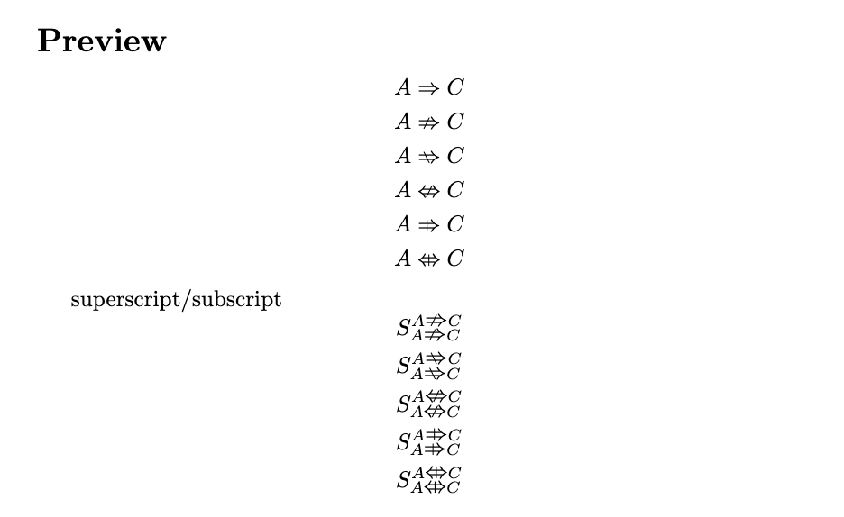

# Narsese Symbols

A LaTeX package providing typeset symbols for Narsese (the formal language of Non-Axiomatic Logic and NARS, see [OpenNARS](https://github.com/opennars/OpenNARS)).



## Features

### Temporal Copulas

| Command | Example | Meaning |
|---------|---------|---------|
| `\predimply` | `$A \predimply C$` | Predictive implication |
| `\predequiv` | `$A \predequiv C$` | Predictive equivalence |
| `\retrimply` | `$A \retrimply C$` | Retrospective implication |
| `\concimply` | `$A \concimply C$` | Concurrent implication |
| `\concequiv` | `$A \concequiv C$` | Concurrent equivalence |

### Connectors

| Command | Example | Meaning |
|---------|---------|---------|
| `\seq` | `$\seq$` | Sequential conjunction |
| `\parr` | `$\parr$` | Parallel conjunction |
| `\op` | `$\op$` | Operation marker |

### Truth Values

| Command | Example | Meaning |
|---------|---------|---------|
| `\truthv{#1}{#2}` | `$\truthv{0.9}{0.75}$` | Truth value |
| `\desirev{#1}{#2}` | `$\desirev{0.8}{0.6}$` | Desire value |

## Installation

The package has been submitted to CTAN. You may directly use `\usepackage{narsese-symbol}` without copying any file of `narsese-symbol` to your writing project. However, updates of `narsese-symbol.sty` may not be synchronized in time to CTAN. If you need to use the latest version, install it in the following ways.

### Option 1: Local Installation

1. Copy `narsese-symbol.sty` to your LaTeX project directory
2. Include in your document:

``latex
\usepackage{narsese-symbol}
``

### Option 2: System-wide Installation

Copy `narsese-symbol.sty` to your TeX distribution's styles directory:
- TeX Live / MacTeX: `~/texmf/tex/latex/narsese-symbol/`
- MiKTeX: `[root]/tex/latex/narsese-symbol/`

Then refresh the filename database (`texhash` or refresh FNDB in MiKTeX).

## Usage

```latex
\documentclass{article}
\usepackage{amsmath}
\usepackage{narsese-symbol}

\begin{document}

% Temporal copulas
$A \predimply C$
$A \retrimply C$
$A \concimply C$

% Truth values
\truthv{0.9}{0.85}
\desirev{0.7}{0.5}

% In superscripts/subscripts
$S_{A \predimply C}$

\end{document}
```

## Requirements

- LaTeX2e
- `graphicx` package (automatically loaded as dependency)

## Supported Symbols Summary

| Symbol Type | Count | Status |
|-------------|-------|--------|
| Temporal Copulas | 5 | ✅ Implemented |
| Connectors | 3 | ✅ Implemented |
| Truth/Desire Values | 2 | ✅ Implemented |
| Other symbols | -- | ❌ Not implemented yet |

## Roadmap

This package is in early development. Planned features:

- [x] Truth value and desire value
- [x] Temporal copulas and connectors 
- [ ] Other copulas and connectors

## Related Projects

- [OpenNARS](https://github.com/opennars/OpenNARS) - The flagship NARS implementation
- [NARS Wiki](https://sites.google.com/site/narsweb/) - Complete NARS documentation

## License

MIT License